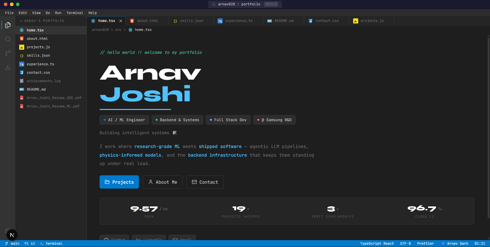
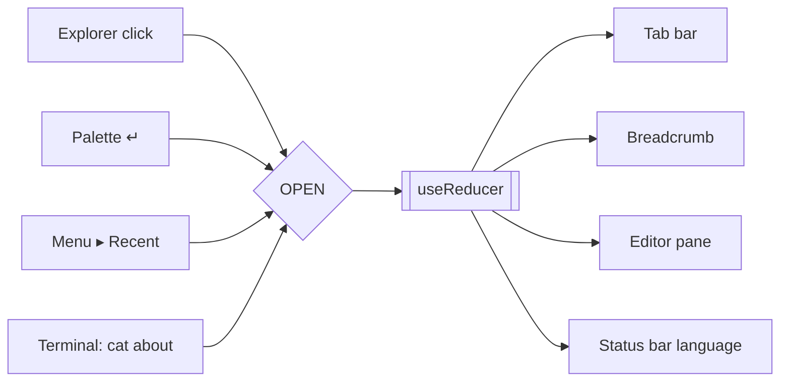

<div align="center">

# Arnav Joshi — Portfolio

### A résumé that opens like a code editor.

[](https://arnavjoshi.tech)
[](https://nextjs.org)
[](https://react.dev)
[](https://www.typescriptlang.org)
[](https://tailwindcss.com)

<br />



</div>

---

Every section of my résumé is a **file you open in a tab**. There is one route, no anchor links, and no scrolling marketing page — navigation happens inside the editor, exactly like the tool the work is done in.

```
src/home.tsx          src/contact.css        logs/achievements.log
src/about.html        src/experience.ts      ./README.md
src/projects.js       data/skills.json       ./Arnav_Joshi_Resume_{SDE,ML}.pdf
```

Each file opens with a tagline in **its own comment syntax** — `//` for TS/JS, `<!-- -->` for HTML and Markdown, `/* */` for CSS, `#` for the log — and animates in top-to-bottom on every tab switch.

---

## Contents

- [Feature tour](#feature-tour)
- [Architecture](#architecture)
- [Theming](#theming)
- [Editing the content](#editing-the-content)
- [Getting started](#getting-started)
- [Deployment](#deployment)
- [Design & engineering notes](#design--engineering-notes)

---

## Feature tour

| Surface | What it does |
|---|---|
| **Explorer** | The résumé as a file tree, with hand-drawn language glyphs per extension (React atom, HTML5 shield, JS/TS badges, `{}`, CSS, Markdown, PDF). PDFs download instead of opening. |
| **Tabs** | Multiple files open at once, closable, order preserved across reloads. The active tab drives the breadcrumb *and* the status-bar language indicator. |
| **Command palette** | `Ctrl P` — fuzzy filter over every file, fully keyboard-navigable, `Esc` to dismiss. |
| **Terminal** | A real (small) shell — see the command table below. `cat projects` opens `projects.js` in the editor. |
| **Menu bar** | File / Edit / View / Go / Run / Terminal / Help, all functional. `Edit ▸ Select All` and `Copy` operate on the live editor pane. |
| **Source control** | Branch, ahead-count, modified/added/deleted stats, and a link to this repo. |
| **Settings** | Six themes, quick actions, and a keyboard-shortcut reference. |
| **Status bar** | Branch, sync counts, active language, encoding, formatter, theme, and a live clock. |

### Keyboard

| Shortcut | Action |
|:--|:--|
| <kbd>Ctrl</kbd> <kbd>P</kbd> | Command palette / go to file |
| <kbd>Ctrl</kbd> <kbd>`</kbd> | Toggle terminal |
| <kbd>Ctrl</kbd> <kbd>B</kbd> | Toggle explorer |
| <kbd>Esc</kbd> | Close any overlay |
| <kbd>↑</kbd> <kbd>↓</kbd> | Terminal history · palette navigation |

### Terminal

```console
arnav@portfolio:~$ help
```

| Command | Behaviour |
|:--|:--|
| `ls` | List files in the current directory |
| `pwd` | Print working directory |
| `cd <dir>` | Change directory (`cd ..` to go up) |
| `cat <file>` | **Opens that section as a tab in the editor** |
| `open <file>` | Same as `cat` |
| `whoami` | One-line introduction |
| `echo <text>` | Print text |
| `date` | Real current date & time |
| `git log` | Recent commits |
| `python --version` | Because of course |
| `clear` | Reset the terminal |

Argument resolution is forgiving: `cat about`, `cat about.html` and `cat src/about.html` all land on the same file. Unknown input returns a real error, not a shrug:

```console
arnav@portfolio:~$ cd nowhere
cd: no such directory: nowhere
```

---

## Architecture

```text
src/
├── app/
│   ├── page.tsx              # mounts <IdeProvider><IdeShell/></IdeProvider>
│   ├── layout.tsx            # fonts, metadata, JSON-LD, pre-paint theme script
│   ├── icon.svg              # editor-mark favicon
│   └── globals.css           # Tailwind v4 token bridge · 6 theme palettes · motion
│
├── content/                  # every word on the site lives here — no copy in components
│   ├── profile.ts            # identity, roles, stats, links, résumés, current focus
│   ├── projects.ts           # cards: tone, one-liner, 2 metric bullets, stack
│   ├── experience.ts         # roles timeline + education
│   └── skills.ts             # grouped skills + achievements
│
└── ide/
    ├── registry.ts           # THE file list — every surface derives from this
    ├── IdeProvider.tsx       # one useReducer: tabs, panels, overlays, theme, terminal
    ├── shell.ts              # pure (command, cwd) → { output, cwd?, open? } — no DOM
    ├── useShortcuts.ts       # single window keydown listener
    ├── FileIcon.tsx          # inline SVG language glyphs
    ├── IdeShell.tsx          # layout composition
    ├── chrome/               # TitleBar · MenuBar · ActivityBar · Explorer · TabBar
    │                         # Editor · TerminalPanel · StatusBar · CommandPalette
    │                         # SettingsPanel · ScmPopover · ThemeToast
    └── files/                # one component per "file" + shared section primitives
```

### One action, four dispatchers

A file can be opened from the explorer, from `↵` in the palette, from `File ▸ Open Recent`, or by typing `cat about` in the terminal. All four dispatch the **same** `OPEN` action, so tab order, recents, breadcrumb and status bar can never disagree with each other.



### The registry is the single source of truth

`registry.ts` holds one array of file descriptors — id, display name, folder, icon, language, comment syntax, layout width. The explorer, tab bar, breadcrumb, command palette, `File ▸ Go`, **and the terminal's `ls` / `cd` / `cat`** all read from it. Adding a section is one registry entry plus one component; every surface picks it up automatically.

### The shell is a pure function

```ts
runCommand(input: string, cwd: string): {
  output: TerminalLine[]
  cwd?: string      // a successful `cd`
  open?: FileId     // `cat` / `open` — applied by the reducer
  clear?: boolean
}
```

No DOM access, no state mutation, no side effects. The reducer applies whatever comes back, which keeps terminal behaviour from drifting away from the explorer's idea of the tree — and makes the whole shell trivially testable.

### Theming without re-renders

Every colour utility resolves to a CSS variable, so switching themes sets **one attribute** on `<html>`. It's a single repaint with zero React re-renders, and all six themes share one set of layout and contrast rules — a theme overrides only its accent trio, syntax hues, surname colour and status-bar pair.

An inline script in `<head>` applies the stored theme **before first paint**, so a restored theme never flashes the default.

---

## Theming

Six editor themes, each using its own authentic palette. The status bar takes the accent colour, exactly like the real thing.

| Theme | Editor | Panel | Accent | Surname | Status bar |
|:--|:--|:--|:--|:--|:--|
| 💙 **Arnav Dark** | `#1e1e1e` | `#252526` |  `#007acc` | `#4fc1ff` | `#007acc` |
| 🌹 **Rosé Pine** | `#191724` | `#1f1d2e` |  `#eb6f92` | `#eb6f92` | `#eb6f92` |
| 🌃 **Tokyo Night** | `#1a1b26` | `#16161e` |  `#7aa2f7` | `#7dcfff` | `#7aa2f7` |
| 🐱 **Catppuccin** | `#1e1e2e` | `#181825` |  `#cba6f7` | `#89dceb` | `#cba6f7` |
| ❄️ **Nord** | `#2e3440` | `#3b4252` |  `#5e81ac` | `#88c0d0` | `#5e81ac` |
| 🍂 **Gruvbox** | `#282828` | `#1d2021` |  `#fabd2f` | `#83a598` | `#fabd2f` |

Choice is persisted to `localStorage` and confirmed with a toast.

---

## Editing the content

No copy is hard-coded in a component. Everything lives in `src/content/`:

| File | Holds |
|:--|:--|
| `profile.ts` | Name, handle, role pills, cycling taglines, bio, stat row, links, résumé paths, current focus |
| `projects.ts` | Per-card: emoji, category tags, accent tone, one-line description, exactly two metric bullets, stack |
| `experience.ts` | Roles timeline (with `current` flag) + education |
| `skills.ts` | Grouped skills + achievements |

Highlighted terms use a tiny `**bold**` convention rendered by `<Emphasis>` in the theme's blue — a two-line helper rather than a markdown runtime.

**To add a section:** add an entry to `src/ide/registry.ts` and a component to `src/ide/files/`. The explorer, palette, breadcrumb, `Go` menu and terminal all update themselves.

---

## Getting started

```bash
git clone https://github.com/Arnav020/Portfolio-Arnav-Joshi.git
cd Portfolio-Arnav-Joshi
npm install
npm run dev
```

Open [localhost:3000](http://localhost:3000).

### Environment

```env
# .env — optional. Without it the contact form composes a mailto: draft instead.
NEXT_PUBLIC_FORMSPREE_ID=your_form_id
```

### Scripts

| Command | |
|:--|:--|
| `npm run dev` | Dev server (Turbopack) |
| `npm run build` | Production build |
| `npm run start` | Serve the production build |
| `npm run lint` | ESLint |
| `npm run analyze` | Build with the bundle analyzer |

---

## Deployment

Deployed on **Vercel**; the whole app prerenders as static content.

> [!IMPORTANT]
> `NEXT_PUBLIC_*` variables are inlined at **build** time. `NEXT_PUBLIC_FORMSPREE_ID` must be set in the Vercel project's environment variables, and the deploy must be a fresh build (a normal push) rather than a promotion of an older one. Enable it for Preview too if you want the form live there.

---

## Design & engineering notes

- **Typography** — [Syne](https://fonts.google.com/specimen/Syne) 700/800 for display type, [JetBrains Mono](https://fonts.google.com/specimen/JetBrains+Mono) for the entire UI. It's a code editor; the interface should be monospaced. Both self-hosted through `next/font`, so there are no external font requests and no layout shift.
- **Motion** — tab switches play a staggered top-to-bottom reveal (the editor pane is keyed on the file id, so React remounts and CSS replays it — no animation library). Skills additionally pop their pills in per group. `prefers-reduced-motion` zeroes both durations **and** delays, since a `backwards`-filled animation would otherwise hold its hidden frame through the stagger.
- **The editor is never empty** — closing the last tab, or `Close All Tabs`, reopens `home.tsx`. A persisted empty tab list is guarded on restore too.
- **Chrome fidelity** — bar heights and type sizes follow real editor chrome: an 11px UI scale, a 22px menu bar, a 30px title bar and a 22px status bar, so the hero and stat row land above the fold on a laptop.
- **Zero UI dependencies** — no component library, no animation library, no terminal emulator. `lucide-react` for icons is the only runtime dependency beyond React and Next; the language glyphs, brand marks and shell are hand-written.
- **Accessibility** — real `<button>`/`<nav>`/`<main>`/`<footer>` semantics, `aria-label`s on every icon control, `aria-expanded` on menus, `role="dialog"` + `aria-modal` on overlays, theme-aware `:focus-visible` rings, and a `role="status"` toast.
- **Responsive** — below `768px` the explorer floats over the editor instead of taking a column, and starts collapsed.

---

<div align="center">

Designed and built by **Arnav Joshi**
<br />
[arnavjoshi.tech](https://arnavjoshi.tech) · [GitHub](https://github.com/Arnav020) · [LinkedIn](https://linkedin.com/in/arnav-joshi-038693291)

</div>
