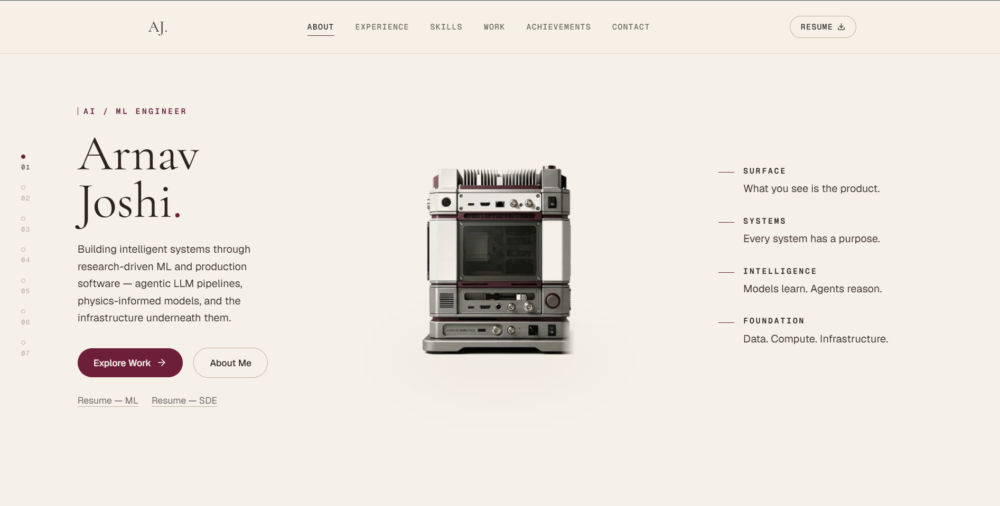

# Arnav Joshi — Portfolio

[](https://nextjs.org)
[](https://react.dev)
[](https://www.typescriptlang.org)
[](https://tailwindcss.com)
[](https://gsap.com)

An editorial, premium AI/ML engineer portfolio built around one central metaphor: **the machine represents the engineer's system**. A 150-frame image sequence of a physical machine progressively explodes as the user scrolls, revealing what's underneath the surface — mirrored by the page's own narrative moving from "what you see" to the systems, intelligence, and infrastructure beneath it.

Canonical site metadata points at `arnavjoshi.dev`.



---

## The core idea

As the user scrolls through the homepage, one continuous machine — never a new image, never a card, never a rectangle — gradually deconstructs across four narrative chapters:

| # | Chapter | The machine |
|---|---|---|
| 01 | **Intro** | Fully assembled |
| 02 | **Foundations** (Education) | Begins revealing internal structure |
| 03 | **The Journey** (Experience) | Further separated — Research → Build → Ship |
| 04 | **The Build** (Projects) | Significantly exploded |

Underneath, two more in-flow sections — **Skills** and **Achievements** — round out the story, followed by **Contact**.

### How the machine animates

- **150 real photographed frames**, background-removed via harmonic (Laplace) inpainting + per-pixel distance-based alpha keying (`scripts/matte-frames.js`) — the studio backdrop and the machine's own cast shadow are both fully transparent; a constant, frame-independent CSS shadow handles grounding instead, so nothing about it can smudge or vary as the machine explodes.
- **GSAP ScrollTrigger** pins the hero section and exposes raw scroll progress (`scrub: true`), which is then smoothed by a self-terminating `requestAnimationFrame` loop (target → lerped display progress) — decoupling the actual draw work from scroll-event cadence so fast, small scroll deltas never read as frame jitter.
- Adjacent frames are **cross-faded** (two `drawImage` calls blended by the fractional part of the continuous frame position) rather than hard-cut on `Math.round`, since 150 discrete frames alone would otherwise read as a slideshow.
- Chapter text panels crossfade via **opacity only** — never `transform` — so text stays in normal layout and never picks up the subpixel/GPU-layer softness that a transformed, fractionally-sized flex/grid cell would cause.

### Responsive strategy

Real scroll-scrubbing needs a wide, geometrically separated grid (index rail / narrative / machine / metadata columns) to guarantee the machine can never overlap text — that only works at `lg` (≥1024px) and above.

- **Desktop, motion allowed** (`PinnedCanvasSpine.tsx`): the full pinned, scroll-scrubbed canvas experience described above.
- **Mobile/tablet, or `prefers-reduced-motion`** (`StackedChapters.tsx`): a plain stacked fallback — each chapter is a normal in-flow section with its own static representative frame, so overlap is structurally impossible rather than merely avoided. Chapters below the fold fade + rise into view on scroll via a shared `ScrollReveal` component.

Both renderers report the active chapter over a small window `CustomEvent` bus (`components/sections/spine/chapters.ts`) so the header nav and the fixed-left progress rail always agree on "where the user is," regardless of which renderer is mounted.

---

## Tech stack

- **Framework**: Next.js 16 (App Router, Turbopack), React 19, TypeScript
- **Styling**: Tailwind CSS v4, a single fixed warm-editorial theme (cream / near-black / burgundy — no dark mode)
- **Animation**: GSAP + `@gsap/react` (`useGSAP`) for the scroll-pinned canvas; plain CSS transitions/keyframes elsewhere
- **Fonts**: Geist Sans & Geist Mono, plus Cormorant Garamond for serif headings
- **Components**: Radix UI (`Dialog` for the mobile nav), `lucide-react` icons
- **Data**: GitHub REST API (`/api/github`), revalidated every 24h — optional `GITHUB_TOKEN` to avoid rate limits
- **Image pipeline**: `sharp` (Node) for the one-time frame-matting script

---

## Project structure

```text
scripts/
└── matte-frames.js          # Background-removal pipeline (frames/ → public/frames-matted/)

src/
├── app/
│   ├── page.tsx              # Homepage: hero spine + Skills/Achievements/Contact
│   ├── layout.tsx            # Root layout, fonts, metadata, JSON-LD
│   ├── work/
│   │   ├── page.tsx           # "Field Reports" — project index
│   │   └── [slug]/page.tsx    # Individual project case study
│   ├── api/github/           # GitHub stats proxy route
│   ├── sitemap.ts, robots.ts, opengraph-image.tsx
├── components/
│   ├── sections/spine/       # The scroll-driven machine + chapter system
│   │   ├── PinnedCanvasSpine.tsx   # Desktop: pinned canvas, frame blend, lerp smoothing
│   │   ├── StackedChapters.tsx     # Mobile/tablet/reduced-motion fallback
│   │   ├── chapters.ts             # Shared progress bands, frame math, event bus
│   │   ├── Chapter{Intro,Education,Experience,Projects}.tsx
│   │   └── ScrollProgressRail.tsx  # Fixed-left chapter index
│   ├── sections/              # SkillsGrid, AchievementsList, ContactCTA
│   ├── project/                # Case-study page components + architecture diagrams
│   ├── layout/                 # Header, Footer, MobileNav
│   └── ui/                     # Shared primitives (Button, Badge, ScrollReveal, …)
├── data/                      # Education, experience, projects, skills, achievements
├── hooks/                     # useSpineNavigation, useScrollSpy, useInView, useMediaQuery, …
├── lib/                       # constants, scroll helpers, GitHub API client
└── types/                     # Shared TypeScript interfaces

public/
├── frames/                    # 150 raw source frames
├── frames-matted/             # 150 background-removed WebP frames (used by the site)
├── resume-ml.pdf, resume-sde.pdf
└── <project>/                 # Per-project screenshots for case studies
```

---

## Getting started

### Prerequisites
- Node.js 18+

### Setup

```bash
git clone https://github.com/Arnav020/Portfolio-Arnav-Joshi.git
cd Portfolio-Arnav-Joshi
npm install
npm run dev
```

Open [http://localhost:3000](http://localhost:3000).

### Optional environment variables

```env
# .env.local — avoids GitHub API rate limits, not required for local dev
GITHUB_TOKEN=your_github_personal_access_token
```

### Scripts

```bash
npm run dev       # Start the dev server (Turbopack)
npm run build     # Production build
npm run start     # Serve the production build
npm run lint      # ESLint
npm run analyze   # Production build with the bundle analyzer
```

### Regenerating the machine frames

The 150 background-removed frames in `public/frames-matted/` are generated once from `public/frames/` (raw source JPEGs) and committed — the site never runs this at request time.

```bash
node scripts/matte-frames.js            # Process all 150 frames
node scripts/matte-frames.js 42         # Process a single frame (for testing changes)
```

---

## Design system

- **Palette**: warm ivory/parchment background, near-black text, a single restrained deep-burgundy accent — used sparingly (active nav, dots, CTA fills) rather than as a large fill. No dark mode; this is the whole identity, not a fallback.
- **Typography**: Cormorant Garamond for large editorial headings, Geist Sans for body/UI, Geist Mono for section labels, dates, tech-stack tags, and numbering.
- **Motion**: custom `cubic-bezier` eases (`--ease-out`, `--ease-in-out`), no default CSS easings. `prefers-reduced-motion` is respected globally — opacity/color transitions survive, movement doesn't.

---

## License

Designed and built by **Arnav Joshi**.
